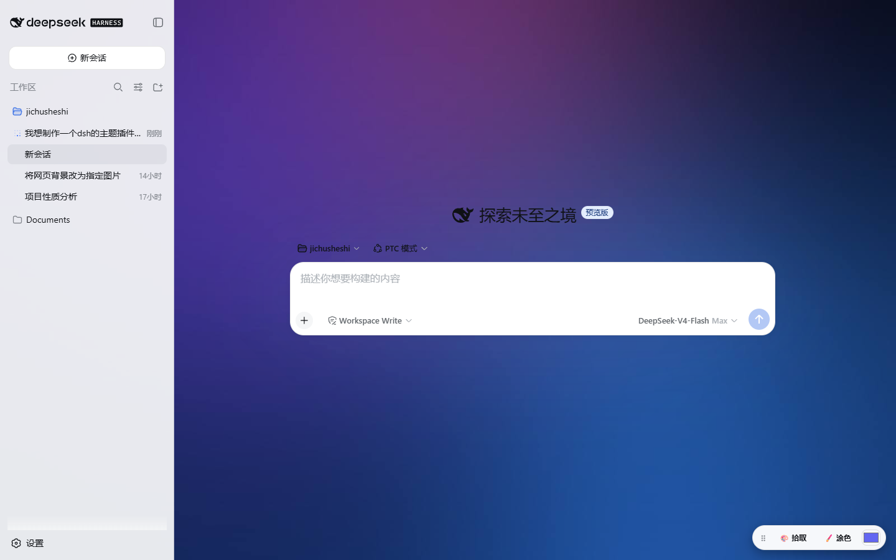
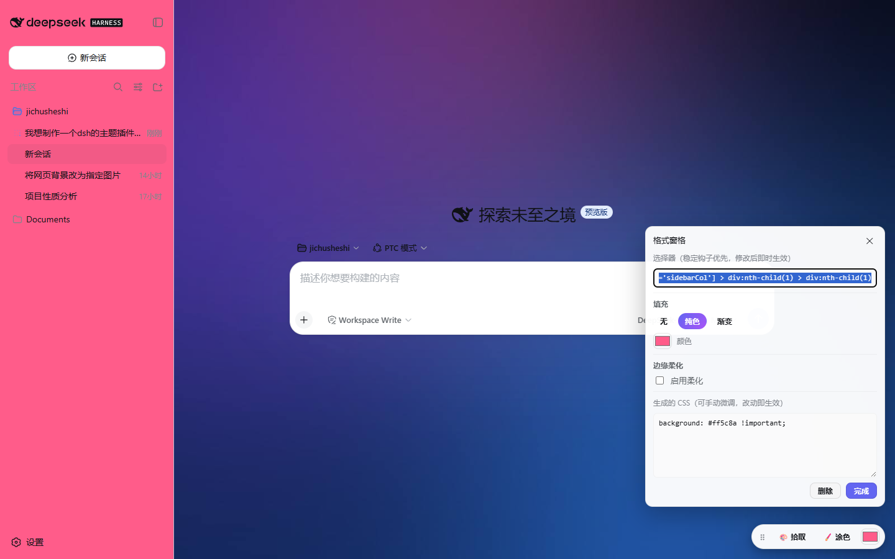
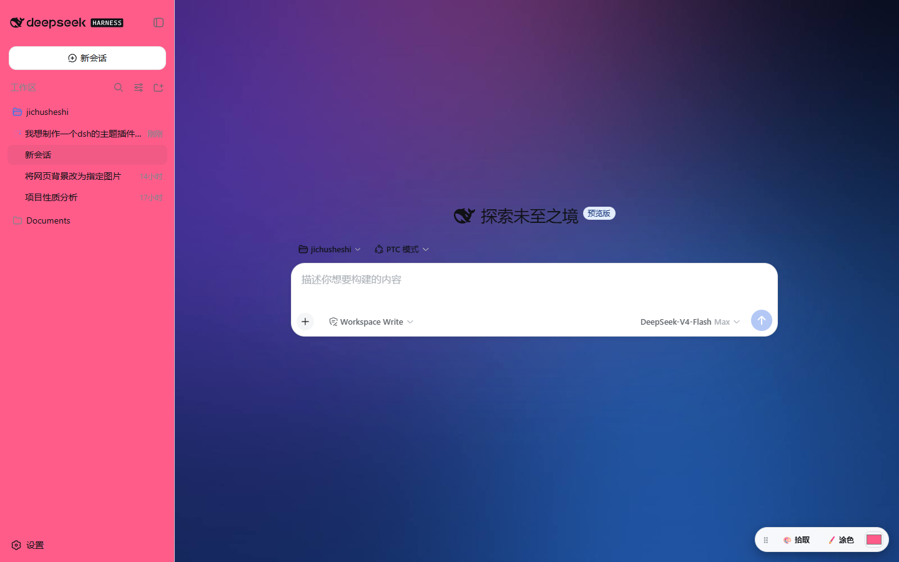
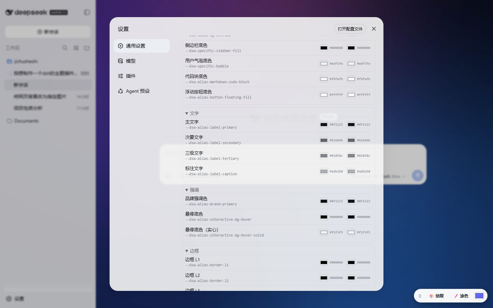
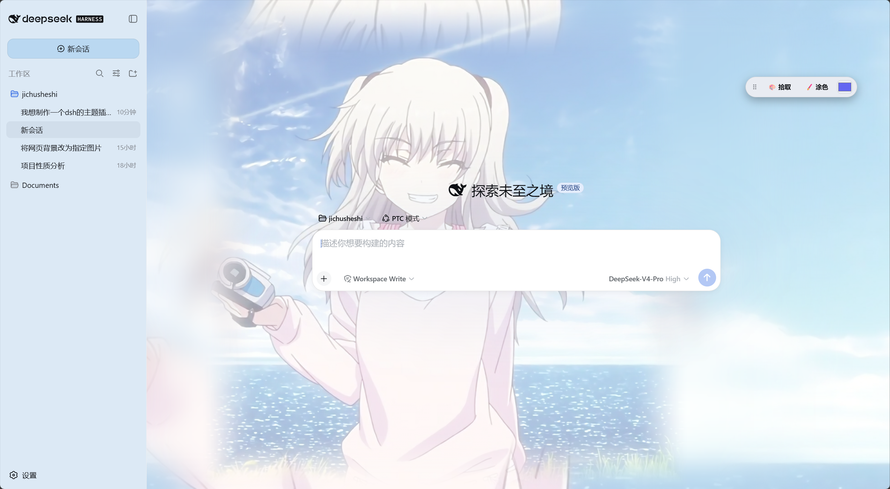

# skin-studio · DSH 主题定制工作室

给 DeepSeek Harness Web GUI 用的**终极自定义插件**：换背景、改配色、涂颜色、写 CSS——全部可视化操作，**不用改任何文件、不用重启服务**。

> 对 dsh 说一句「安装一下这个主题插件：`https://github.com/123hhh191/dsh-deep-whale`」，或者按下面的步骤手动装。

## 效果演示

| 背景图层系统（多层合成/模糊/羽化） | 元素拾取与格式窗格（Word 式微调） |
|---|---|
| [](preview/preview-background.png) | [](preview/preview-format-pane.png) |

| 取色涂色（点哪涂哪） | 设置入口（通用 → 主题定制） |
|---|---|
| [](preview/preview-paint.png) | [](preview/preview-settings.png) |

| 实际使用效果 |
|---|
| [](preview/preview-user-demo.png) |


## 快速开始（3 步）

```sh
# 1. 克隆仓库（或下载 zip 解压）
git clone https://github.com/123hhh191/dsh-deep-whale

# 2. 安装到你的 harness（在 harness 目录下执行）
cd <你的 harness 目录>
dsh plugin --profile web add ../dsh-deep-whale/skin-studio

# 3. 刷新浏览器页面
```

打开 设置 ⚙ → **通用** → **主题定制** 即可开始使用。**不需要重启服务**。

### 环境要求

- 已安装并运行 `dsh` CLI（`dsh web` 模式）
- 现代浏览器（Chrome / Edge / Firefox，推荐 Chrome 系）

### 卸载

```sh
dsh plugin --profile web remove @dsh-external/dsh-client-ui-skin-studio
```

## 功能特性

- **背景图层系统**：像壁纸引擎一样叠多层背景——
  - 每层独立设置**图片大小**（铺满/完整显示/拉伸/自定义缩放 10-300%/平铺）、**位置**（左右/上下自由移动滑块 0-100%）、**模糊**（0-60px）、**透明度**（0-100%）、**边缘羽化**（0-200px 四边渐隐）
  - 纯色图层当滤镜/压暗层；图层可增删、排序、显隐；全局压暗滑块
  - **「壁纸三层预设」**一键生成"清晰完整图 + 模糊带 + 铺满底层"效果
- **主题 Token 编辑**：23 个常用 `--dsw-alias-*` token 分组编辑（表面/文字/强调/边框/状态/滚动条），亮/暗两套色板实时生效
- **原始 CSS**：任意 CSS 注入页面末尾（优先级最高），附稳定 DOM 钩子速查
- **元素拾取工具栏**（右下角浮动，**⠿ 可拖动**，位置自动记忆，设置里可开关）：
  - 🎨 **拾取**：悬停高亮，**点击组件立即用取色器颜色填充**，并打开 Word 式格式窗格微调
  - 🖌️ **涂色**：选好颜色，点哪个元素就把哪个元素的背景涂成该颜色
  - 格式窗格：填充（无/纯色/**渐变**：线性↔径向、方向角度、起始/结束色、渐变强度）、**边缘柔化**（模糊强度+范围，自动消隐分割线与产品淡出层）
- **方案导入/导出**：整套配置导出为 JSON，可备份/分享/一键恢复默认
- **纯客户端**：不注入服务、不触达模型请求；卸载即完全复原

## 使用指南

1. **打开设置**：点击左下角 ⚙ 设置 → **通用** → **主题定制**
2. **换背景**：「＋ 添加图片层」上传图片 → 调整尺寸/位置/模糊/透明度/羽化 → 不满意点「壁纸三层预设」一键生成层次效果
3. **改颜色**：两种方式——
   - 右下角工具栏选色 → 🖌️ 涂色 → 点页面任意元素，立即涂上该颜色
   - 🎨 拾取 → 点元素 → 格式窗格里细调渐变/柔化
4. **精细定制**：Token 色板改全局配色；原始 CSS 写任意样式
5. **保存分享**：「导出方案」下载 JSON，发给别人「导入方案」即可复刻你的主题

### 稳定 DOM 钩子速查（写原始 CSS 用）

| 钩子 | 对应区域 |
|---|---|
| `[data-pane="sidebar"]` / `[class*='sidebarCol']` | 左侧导航栏 |
| `[data-pane="conversation"]` / `[class*='centerCol']` | 对话区 |
| `[data-composer-seat]` | 输入栏 |
| `[data-composer-card]` | 输入卡片 |
| `[data-chat-flow]` | 消息流 |
| `body[data-ds-dark-theme]` | 暗色模式前缀 |

## 常见问题

**Q：装完没看到「主题定制」？**
刷新浏览器页面（Ctrl+F5 强制刷新）。还不行就检查：`dsh plugin --profile web list` 里是否有 `@dsh-external/dsh-client-ui-skin-studio`。

**Q：删掉了克隆目录后插件失效了？**
`dsh plugin add <本地路径>` 是 link 方式安装，目录被删插件就失效。重新 clone 后再 add 一次即可（或把目录放到固定位置）。

**Q：背景图想自由移动位置？**
用「完整显示」或「自定义缩放」模式（铺满/拉伸模式下位置移动效果微弱/无效，这是 CSS 的固有行为）。

**Q：换了浏览器/电脑，配置还在吗？**
配置存在浏览器 localStorage，不跨设备。用「导出方案」导出 JSON，新环境「导入方案」即可。

**Q：和别的皮肤/插件冲突吗？**
不冲突。皮肤（如 maid-atelier）与本工具可共存；背景显示优先级按 DOM 图层顺序，可在插件里关掉背景图层避免叠加。

## 已知限制

- CSS-module 哈希类名（如 `.gdEzaW_bubble`）每次构建会变，请勿写入用户 CSS——用稳定 data-* 钩子
- Token 编辑器只支持不透明色；带透明度的值请用原始 CSS 层

## 开发与构建

```sh
pnpm install
pnpm build    # 输出 lib/index.js（host 半）+ lib/client.js（浏览器半）
```

## 许可

MIT。
